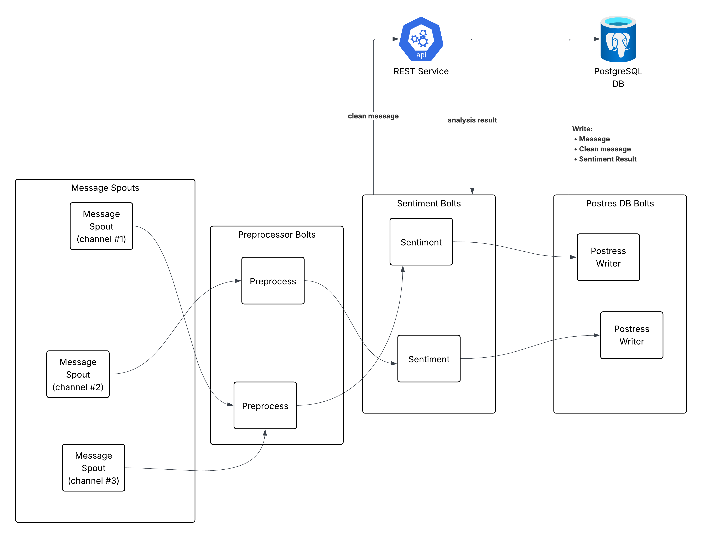

# Twitch Sentiment Storm

This project consists of the following:

- A java project that can build a Storm topology
- A python rest server to handle data analytics
- A docker-compose to manage running locally
- A superset instance for visualisations

There's a full writeup that will be included _after_ the grades have been released to ensure the work is not copied.  It will contain a full explanation of the motivations behind this project.

I've also included an example CSV which shows the kind of data that the pipeline will produce, that is visible here:

- [example_of_processed_data.csv](example_of_processed_data.csv)

This just contains 7,000~ records gathered during a brief run of the pipeline.

## Architecture

## How to use it?

Right now you need to perform the following actions:

1. Build the maven project, this produces the Topology jar
2. Modify the twitch streams you want to connect to in `TwitchMessageSpout` and populate your oauth token
3. Run `docker-compose up --build -d`.  This should raise the various services required.
4. Run the `deploy-topology.sh` script after the topology has been built, this will ensure it is added to the deployed Storm cluster
5. If you are going to use superset, run `superset-startup.sh`.  This will create the right credentials.  You can log in with `admin`/`admin`.

## FAQ

> Q: How can I change the sentiment analysis model being used?
> 
> A: Look at `app.py`, you can change the model in there.  Provided the interface is the same, you can swap this to any model you wish without having to modify the topology.

> Q: The scripts aren't working
> 
> A: Ensure they have execute permission.  Try `chmod +x deploy-topology.sh` for example.

> Q: How do I compile the topology?
> 
> A: The easiest way is to import the project in to Intellij and get Maven to handle it for you.  The `pom.xml` should have all the dependencies setup.

> Q: How do I run it in local mode?
> 
> A: You need to change the Postgres and Sentiment Bolt URLs to point to localhost (since you'll be running it outside the container).  Then look in the `pom.xml` and remove `<scope>provided</scope>` in the `storm` library, since it's not going to be available when running in local mode.  

## What's left to do?

- [ ] Resolve python server bottleneck.  Possibly deploy to k8s.
- [ ] Resolve DB write bottleneck, possibly replace with Apache Cassandra
- [ ] Anywhere there's a hardcoded variable (localhost vs. docker network names), replace them with config variables.
- [ ] Build a better interface for subscribing to streamer channels and deploying more spouts.

## Acknowledgements

The author acknowledges the use of AI-based coding support tools, specifically ChatGPT, during the implementation of sections of this project, including the Twitch spout and database connectivity.
All AI-assisted content was critically reviewed, tested, and incorporated under the author’s responsibility.
